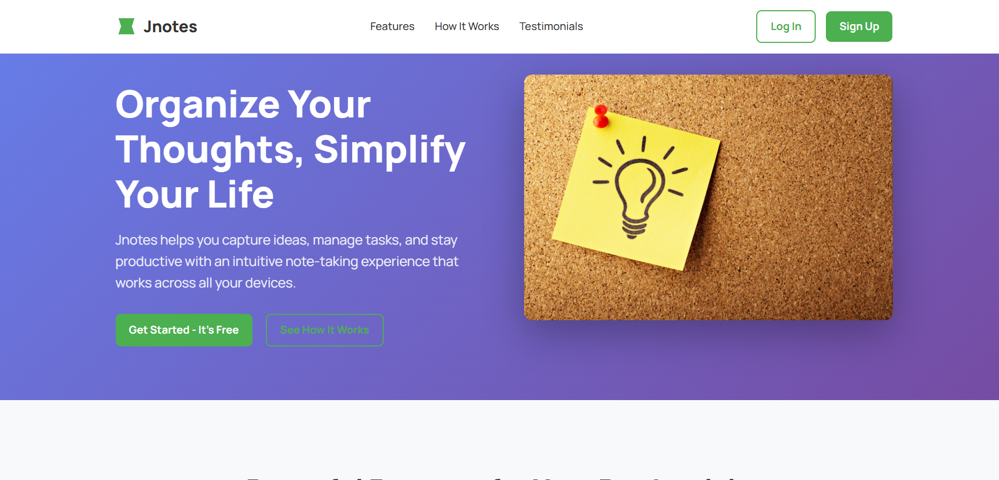
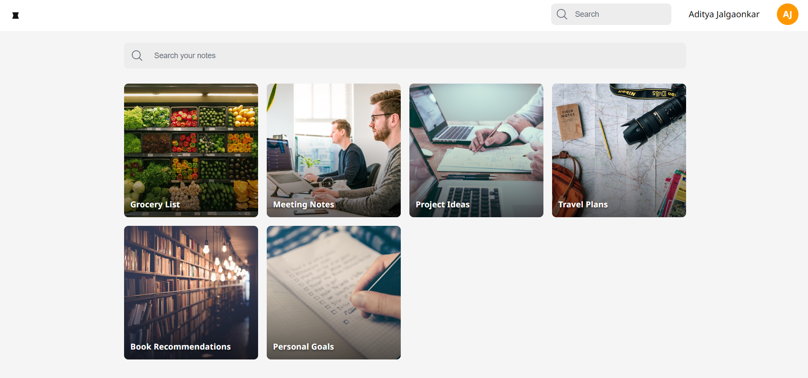
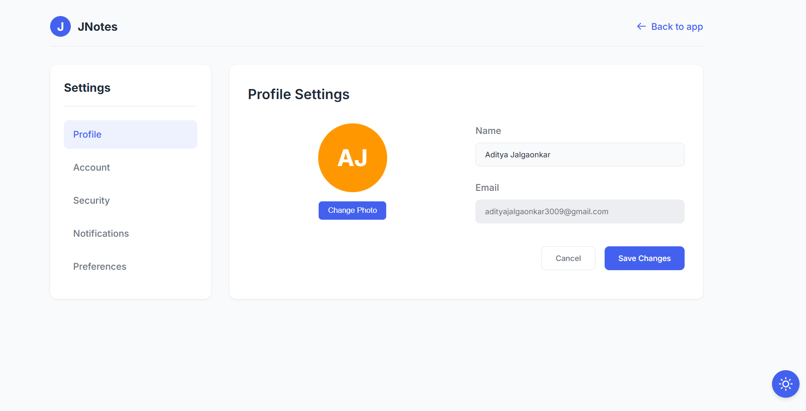

# 📝 JNotes – Real-Time Firebase Note-Taking Web App

[JNotes](https://storage.googleapis.com/jnotes-3009/start/intro_page.html) is a modern, minimal, and real-time note-taking web application that allows users to create, edit, and manage notes securely. It is designed with Firebase at its core and leverages several GCP services for scalability, real-time sync, and cloud integrations.

---

## 🚀 Features

- 🔐 User Authentication via Firebase Auth (Google Sign-In)
- 🗒️ Real-time note creation and updates using Firestore
- 📂 Category-based note organization
- ☁️ Firebase Storage for file uploads
- 🔔 Pub/Sub Notifications for file upload events
- 🌐 Deployed on GCP with public hosting

---

## 🧱 Tech Stack

### 🔧 Frontend
- HTML5, CSS3, JavaScript (Vanilla)

### 🔥 Firebase
- Firebase Authentication
- Firebase Firestore (NoSQL database)
- Firebase Storage
- Firebase Hosting

### ☁️ Google Cloud Platform (GCP)
- **Cloud Storage Buckets** – for file uploads  
- **Pub/Sub** – for triggering notifications on file events  
- **Cloud Functions (optional)** – for backend logic (if implemented)  
- **BigQuery** – to log and analyze app usage and activity  

---

---

## 🌍 Deployment

The app is hosted on **Google Cloud Platform** via Firebase Hosting, providing global CDN support and HTTPS.

---

## 📷 Screenshots

### 🔐 Intro page

### 🗒️ Home page

### 📁 Setting

---

## 🧠 Future Improvements

- 🔎 Full-text search for notes
- 📅 Reminders and scheduling with Calendar API
- 🌙 Dark mode
- 🧑‍🤝‍🧑 Real-time collaborative notes
- 📊 Analytics dashboard (powered by BigQuery)

---

## 👨‍💻 Author

**Aditya Jalgaonkar**  
[GitHub](https://github.com/adityaj3009)
[Linkedin](https://www.linkedin.com/in/aditya-jalgaonkar-b72a04282/)

---

